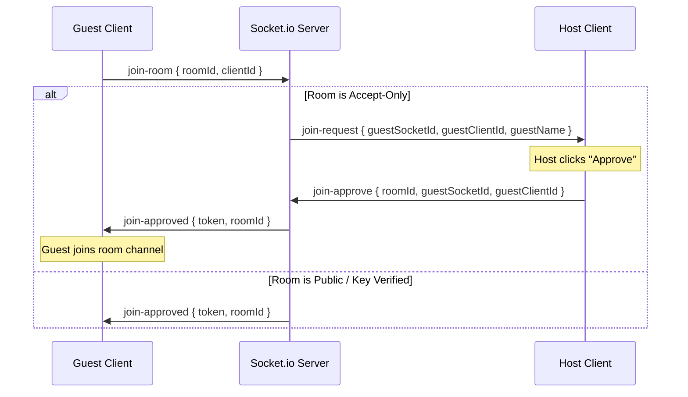

# Stash: Project Details, Architecture, & Core Concepts

Stash is an ephemeral, room-based file-sharing, live screen/webcam broadcasting, and real-time synchronized clipboard platform. It features a hybrid transmission system combining **direct Peer-to-Peer (P2P) WebRTC connections** for zero-cloud bandwidth costs with a secure **Supabase Cloud fallback** for offline storage.

---

## 1. Directory Tree & File Manifest

The application codebase is structured as a monorepo containing distinct `frontend` and `backend` services:

```text
Stash/
├── backend/
│   ├── src/
│   │   ├── utils/
│   │   │   ├── auth.js            # Cryptographic token signing & validation middleware
│   │   │   └── errors.js          # AppError class & global express handler
│   │   ├── controller.js          # REST controllers (rooms, file uploads, previews, auth)
│   │   ├── db.js                  # Postgres helper configurations (if applicable)
│   │   ├── routes.js              # Express endpoint bindings
│   │   ├── server.js              # Express app init & Socket.io events manager
│   │   ├── supabase.js            # Supabase SDK instance & bucket init
│   │   └── upload.js              # Multer configuration for file streaming
│   ├── .env                       # Backend secret credentials
│   ├── Dockerfile                 # Production backend container build file
│   └── package.json               # Backend dependencies (express, socket.io, supabase-js)
│
└── frontend/
    ├── src/
    │   ├── assets/                # CSS vectors & brand assets
    │   ├── components/            # Isolated React UI components
    │   │   ├── ui/                # Base design system components (sidebar, drawer, etc.)
    │   │   ├── FileCard.jsx       # Card element representing shared files & custom audio player
    │   │   ├── FileListFeed.jsx   # List container managing file lists and download progress states
    │   │   ├── GateScreen.jsx     # Security interface (passwords & host approval lobby)
    │   │   ├── ScreenShare.jsx    # WebRTC stream casting overlay & controls
    │   │   ├── SettingsDrawer.jsx # Settings drawer for password setup & security toggles
    │   │   ├── Sidebar.jsx        # Navigation sidebar for switching rooms
    │   │   ├── UploadForm.jsx     # File drop-zone upload container
    │   │   └── VoiceRecorder.jsx  # Mic capture utility producing WebM audio files
    │   ├── hooks/
    │   │   └── useStash.js        # Core custom hook coordinating WebSockets, state, and WebRTC
    │   ├── pages/
    │   │   └── AppPage.jsx        # Main layout dashboard orchestrating view modes
    │   ├── App.jsx                # Router & root React state bindings
    │   ├── index.css              # Main glassmorphic design system stylesheets
    │   └── main.jsx               # Entry-point bootstrap rendering index.html root
    ├── vite.config.js             # Vite configurations (bundler, ports, aliases)
    └── index.html                 # Main SPA HTML structure
```

---

## 2. Comprehensive REST API Specifications

All HTTP REST endpoints operate under the host address `/api` (dev port `3000`).

| HTTP Method | Endpoint | Headers Required | Request Payload / Params | Response Payload (Success) | Description |
| :--- | :--- | :--- | :--- | :--- | :--- |
| **POST** | `/rooms` | `x-host-id` | `body: { id, name, description, is_protected, access_mode }` | `{ status: 'success', data: { room } }` | Creates a new room. Generates initial Stack Key passcode if room is protected. |
| **GET** | `/rooms/:room_id` | `x-host-id`, `x-room-access-token` | `params: { room_id }` | `{ status: 'success', data: { room } }` | Fetches room parameters. If unauthorized (no token, no host match) and room is protected, returns `403 Forbidden` with room metadata fields. |
| **POST** | `/rooms/:room_id/join` | None | `body: { password }` | `{ status: 'success', data: { token } }` | Verifies room key. Returns cryptographic signature token if verified. |
| **POST** | `/rooms/:room_id/update` | `x-host-id` | `body: { name, description, is_protected, accept_only }` | `{ status: 'success', data: { room } }` | Updates room configurations (e.g., changes name, description, or security mode). |
| **POST** | `/rooms/:room_id/rotate-key` | `x-host-id` | `params: { room_id }` | `{ status: 'success', data: { room } }` | Forces immediate rotation of the 6-digit room passcode. |
| **DELETE** | `/rooms/:room_id` | `x-host-id` | `params: { room_id }` | `{ status: 'success', data: { message } }` | Purges a room and all files linked to it from database & object bucket. |
| **GET** | `/room` | None | None | `{ status: 'success', data: { room_id } }` | Auto-discovery route. Resolves caller public IP and returns the hashed room ID. |
| **GET** | `/files/:room_id` | `x-room-access-token` | `params: { room_id }` | `{ status: 'success', data: { files } }` | Fetches lists of active files in that room. Passes through `checkRoomAccess` guard. |
| **POST** | `/upload` | `x-room-access-token` | `multipart/form-data: { files, roomId, expiresHours }` | `{ status: 'success', data: { files } }` | Parses files via Multer and streams them directly into Supabase Storage under room-scoped folders. |
| **GET** | `/preview/:id` | `x-room-access-token` | `params: { id }` | `{ status: 'success', data: { url } }` | Generates a 10-minute temporary S3 signed download/preview URL for images/videos/audios. |
| **POST** | `/download/:id` | `x-room-access-token` | `params: { id }` | `{ status: 'success', data: { url } }` | Increments file's `download_count`. If burn-after-download is set and counter matches threshold, triggers file deletion. |
| **DELETE** | `/files/:id` | `x-room-access-token` | `params: { id }` | `{ status: 'success', data: { id } }` | Deletes file metadata from Postgres and purges source object binary from Supabase bucket. |

---

## 3. Real-Time WebSocket Event Flows (Socket.io)

WebSockets manage live messaging, room state updates, signaling metadata, and access approval loops:



### Event Manifest & Payloads
*   `"join-room"` (Client ➔ Server): Sent when connecting. Payload: `{ roomId, clientId, isHost }`. Adds socket to room channel.
*   `"join-request"` (Server ➔ Host): Relays waiting guest information to host. Payload: `{ roomId, guestSocketId, guestClientId, guestName }`.
*   `"join-approve"` (Host ➔ Server): Sent by host to approve access. Payload: `{ roomId, guestSocketId, guestClientId, hostId }`.
*   `"join-approved"` (Server ➔ Guest): Informs guest they are approved and provides access token. Payload: `{ token, roomId }`.
*   `"join-deny"` (Host ➔ Server) & `"join-denied"` (Server ➔ Guest): Informs waiting guest they were rejected.
*   `"file-added"` (Server ➔ Room): Broadcast when a user uploads files, prompting others to append them to local state. Payload: `{ files }`.
*   `"file-deleted"` (Server ➔ Room): Broadcast when a file is deleted. Payload: `{ id }`.
*   `"clipboard-send"` (Client ➔ Server ➔ Room): Distributes copied text snippet to other room members. Payload: `{ text }`.
*   `"clipboard-clear"` (Client ➔ Server ➔ Room): Commands all clients in room to wipe active shared clipboard cache.
*   `"screen-share-start"` (Presenter ➔ Server ➔ Room): Broadcasts that a user has initiated a video stream. Payload: `{ roomId }`.
*   `"screen-share-signal"` (Client ➔ Server ➔ Target): Relays WebRTC SDP offers/answers or ICE candidates between presenter and viewer. Payload: `{ targetId, signal }`.
*   `"screen-share-stop"` (Presenter ➔ Server ➔ Room): Broadcasts stream end, shutting down peer connections. Payload: `{ roomId }`.
*   `"room-updated"` (Server ➔ Room): Broadcasts room setting changes or rotated passkeys. Payload: `{ id, name, description, is_protected, accept_only, has_stack_key, stack_key_expires_at, stack_key }`.

---

## 4. Key Architectural Engineering Details

### A. WebRTC P2P Data Channel Chunking
Because `RTCDataChannel` enforces maximum packet limits (usually 64KB, but capped at **16KB** for cross-browser safety), transferring a file requires fragmenting the buffer:
1.  **Read file**: The uploader browser reads the file as an `ArrayBuffer` using `FileReader`.
2.  **Fragmenting**: Slices the buffer into blocks:
    ```javascript
    const chunkSize = 16384; // 16KB
    let offset = 0;
    while (offset < file.size) {
        const chunk = fileData.slice(offset, offset + chunkSize);
        dataChannel.send(chunk);
        offset += chunkSize;
    }
    dataChannel.send("EOF"); // End of File signal
    ```
3.  **Assembly**: The downloader browser receives chunks in `dataChannel.onmessage` events, appends them to a memory array, and on receiving `"EOF"`, instantiates `new Blob(receivedChunks)` to download the file directly from memory.

### B. Access Token Cryptography (HMAC-SHA256)
Room tokens are signed statelessly on the backend using a server-side environment secret key:
```javascript
export const generateRoomToken = (roomId, clientId) => {
    const data = `${roomId.trim()}:${clientId.trim()}`;
    const signature = crypto.createHmac('sha256', SECRET).update(data).digest('hex');
    return `${data}:${signature}`;
};
```
When validated, the backend splits the token into components, re-computes the signature using the server secret, and asserts that the calculated signature matches the token's signature, and that the token `roomId` matches the URL resource path parameter.

### C. Voice Recorder Chromium WebM Duration Workaround
WebM streams created by browser microphones using `MediaRecorder` do not write duration metadata indices since the duration is unknown during recording. Chrome reads this duration as `Infinity`. We solve this on load with a seek-scan trick:
```javascript
const onLoadedMetadata = () => {
    if (audio.duration === Infinity) {
        // Seek to near-infinite time (10^101 seconds)
        audio.currentTime = 1e101;
        audio.ontimeupdate = function() {
            this.ontimeupdate = null; // Unbind to prevent loop
            audio.currentTime = 0;    // Reset to beginning
            setDuration(formatTime(audio.duration)); // Duration is now computed!
        };
    }
};
```

---

## 5. UI/UX & Styling Token Implementations

Stash is styled with a sleek glassmorphic theme inside [index.css](file:///c:/Users/HP/Desktop/codding%20projects/Stash/frontend/src/index.css):
*   **Palette**: Main background is deep `#07070a` / `#0a0a0f`, cards render at `#111118`, and hover borders utilize `white/[0.06]` to represent specular glass edges.
*   **Glow Accents**: Primary action buttons, ranges, and notifications utilize indigo (`#6366f1` / `text-indigo-400`).
*   **Animations**: Custom fade-ups (`animate-fadeUp`) and recording pulse shadows (`animate-recording`) provide responsive UI feedback.
*   **Micro-interactions**: Hover events trigger translation scale adjustments (`hover:scale-105`), and deleting a file replaces the trash icon with an active rotating spinner loading state.
